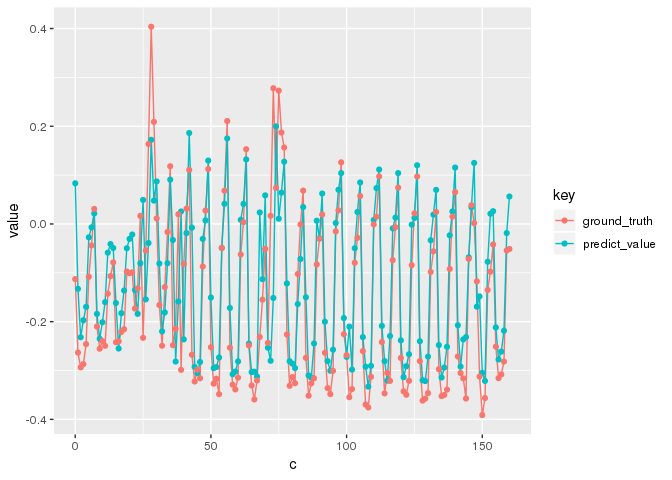

### Load library

``` r
library(data.table)
library(ggplot2)
library(dplyr,warn.conflicts=F, quietly=T)
library(tidyr)
library(abind)
library(forecast)
library(keras)
```

### Load data

``` r
# training data 
station05_17 <- fread('train0517.csv')
# testing data
station18 <- fread('train18.csv')
```

### Keep kaohsiung station's data

``` r
ks_train <- station05_17[station05_17$TKT_BEG==185,]
ks_test <- station18[station18$TKT_BEG==185,]
```

### Preprocessing

``` r
ks_train$BOARD_DATE = as.Date(as.character(ks_train$BOARD_DATE),'%Y%m%d')
ks_train$year = factor(year(ks_train$BOARD_DATE))
```

### Data visualize

``` r
ggplot(ks_train, aes(x=year, y=進站)) + geom_boxplot()
```


### Normalize data

``` r
train <- ks_train$進站
test <- ks_test$進站

mean <- mean(train)
std <- mean(train)
train <- scale(train, center = mean, scale = std)
test <- scale(test, center = mean, scale = std)
```

### Load training & testing data

#### Do not use this method when data is large

``` r
traindata <- data.frame()
trainlabel <- c()
for (i in c(21:4748)){
  traindata <- rbind(traindata, train[(i-20):(i-1)])
  trainlabel <- c(trainlabel, train[i])
}

testdata <- data.frame()
testlabel <- c()
for (i in c(21:181)){
  testdata <- rbind(testdata, test[(i-20):(i-1)])
  testlabel <- c(testlabel, test[i])
}
```

### Reshape data

``` r
traindata <- as.matrix(traindata)
trainlabel <- as.matrix(trainlabel)
testdata <- as.matrix(testdata)
testlabel <- as.matrix(testlabel)

train <- array_reshape(traindata, dim = c(dim(traindata)[[1]],1,dim(traindata)[[2]]))
test <- array_reshape(testdata, dim = c(dim(testdata)[[1]],1,dim(testdata)[[2]]))


dim(train)
```

    ## [1] 4728    1   20

``` r
dim(test)
```

    ## [1] 161   1  20

### Build keras LSTM model

``` r
model <- keras_model_sequential() %>%
  layer_lstm(units = 64, return_sequences = TRUE,
             input_shape = c( 1,20 ) )%>%
  layer_lstm(units = 64, activation = "relu")%>%
  layer_dense(units = 1)

model %>% compile(
  optimizer = optimizer_adam(),
  loss = "mse",
  metrics = c("mae")
)

model %>% fit(train, trainlabel,
              epochs = 50, batch_size = 32, validation_split = 0.1)
```

### Evaluation

``` r
result <- model %>% predict(test, verbose=0)
mean(abs(result - testlabel))
```

    ## [1] 0.06908342

### Plot result & Store as a csv file

``` r
ks_mae <- mean(abs((result * std + mean) - (testlabel* std + mean)))

dat <- data.frame(c=0:160, predict_value=result, ground_truth=testlabel)

dat %>%
  gather(key,value, predict_value, ground_truth) %>%
  ggplot(aes(x=c, y=value, colour=key)) +
  geom_line() +
  geom_point() 
```



``` r
ks_result <- cbind(testlabel* std + mean, result * std + mean)

#write_csv(ks_result, "ks_result.csv")
```
